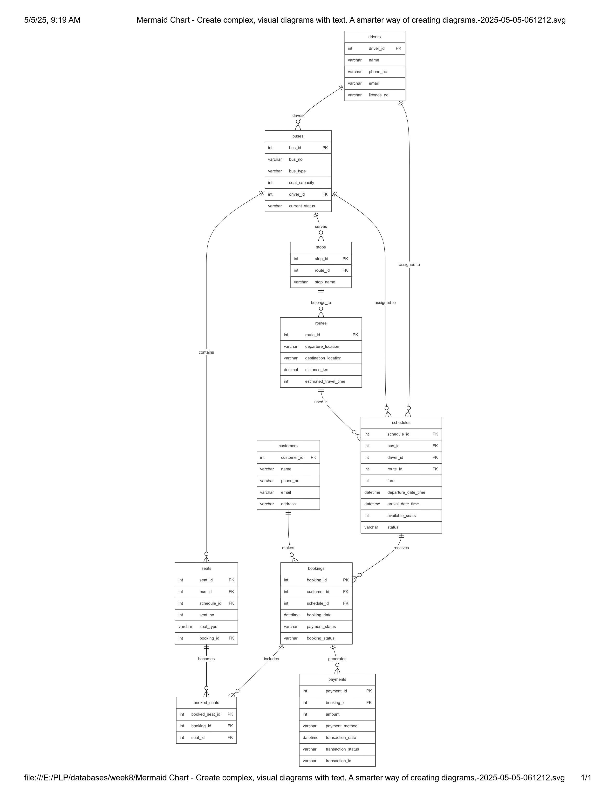

# ScholarTrack and TransitLinkDB Project

## Project Description

This project consists of two parts:

1. **TransitLinkDB**: A database system for managing bus transportation, including customers, buses, routes, schedules, and bookings.
2. **ScholarTrack**: A database and CRUD API for managing student enrollments, courses, and related data for a school system.

---

## 📌 Submission Instructions

This repository includes:

- A well-commented `.sql` file for **TransitLinkDB**.
- Source code files for **ScholarTrack**, organized in a folder structure.
- SQL scripts used to create the databases.
- A screenshot or link to the ERD for **TransitLinkDB**.

---

## 🧠 Question 1: TransitLinkDB

### Description

TransitLinkDB is a database designed to manage a bus transportation system. It includes tables for customers, buses, routes, stops, drivers, schedules, seats, bookings, and payments.

### How to Run/Setup

1. Import the `TransitLinkDB.sql` file into your MySQL database.
2. The database will be created with sample data for testing.

### File

- [question1/TransitLinkDB.sql](question1/TransitLinkDB.sql)

### ERD



Alternatively, you can find the ERD in the file `ERD-TransitLinkDB.jpg` in this repository.

---

## 💻 Question 2: ScholarTrack

### Description

ScholarTrack is a school management system that includes a database and a CRUD API. It allows managing students, courses, and enrollments.

### How to Run/Setup

1. Import the `script.sql` file into your MySQL database to create the `scholar_track` database.
2. Navigate to the `scholartrack-api` folder and install dependencies:
   ```bash
   npm install
